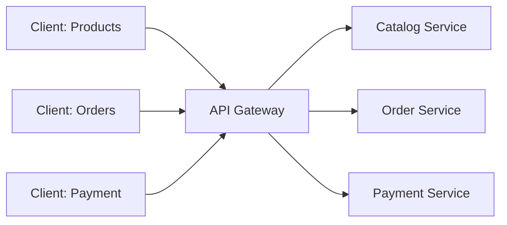
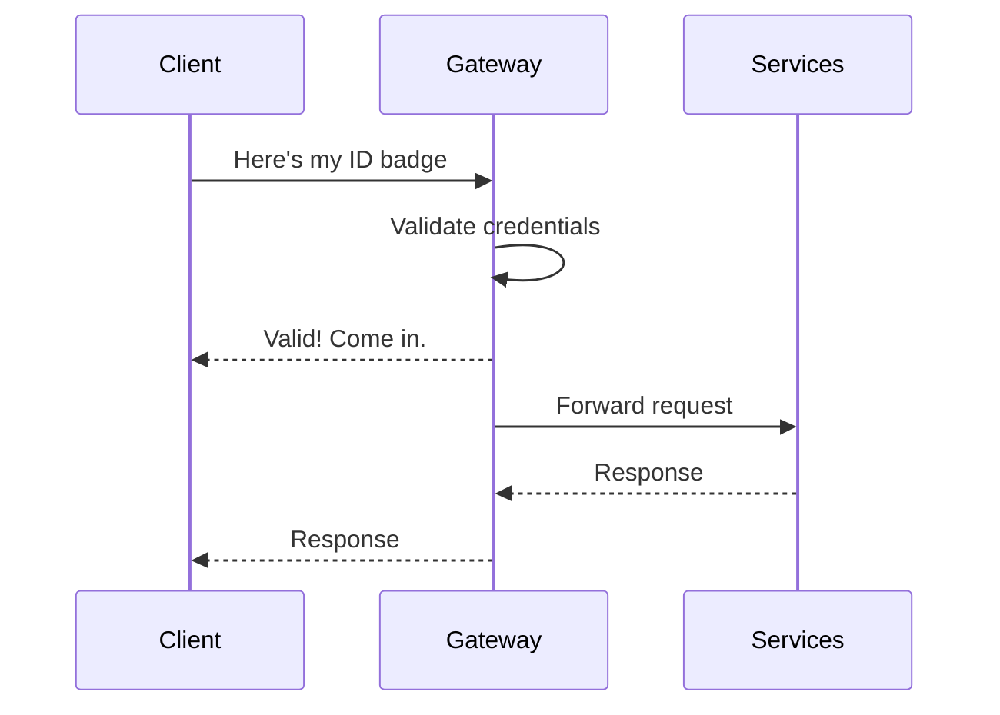
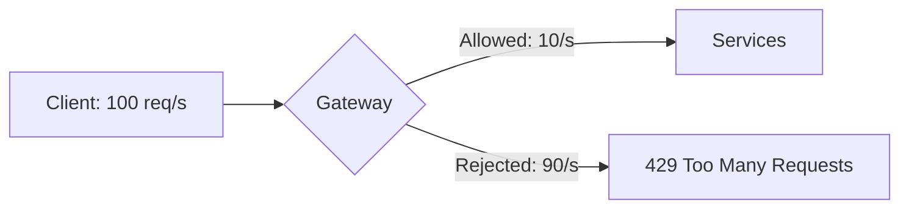
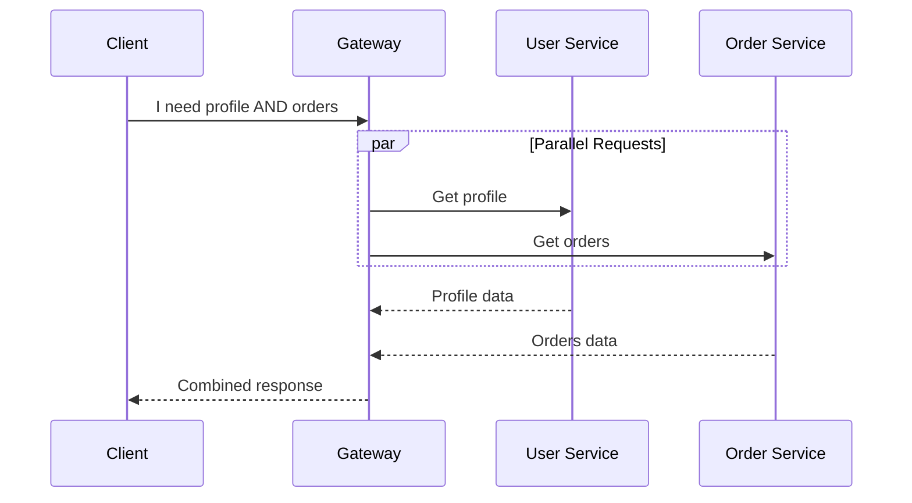
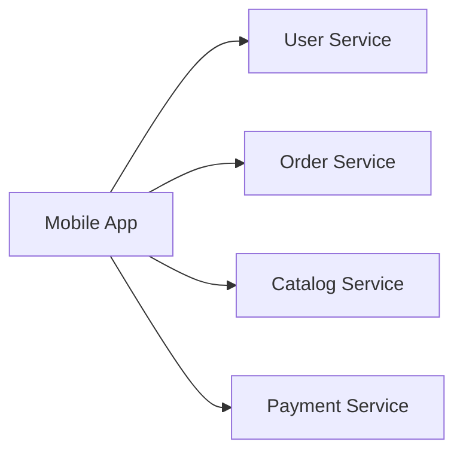
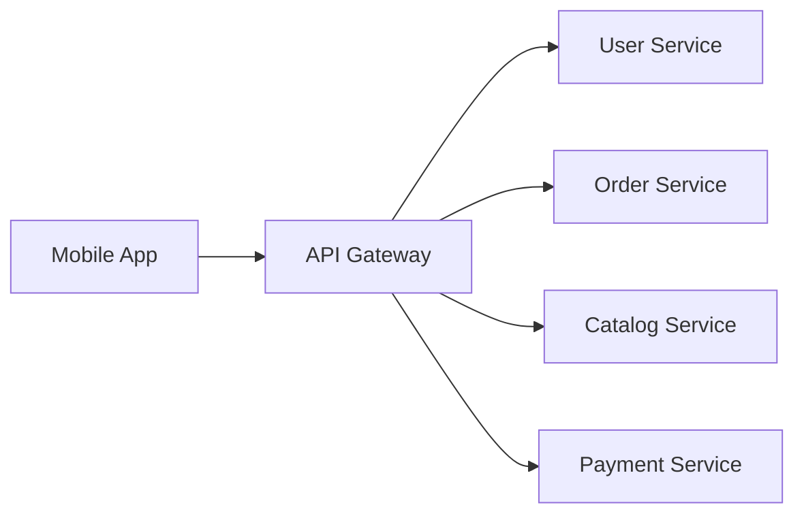

# API Gateway Pattern

Imagine you're staying at a fancy hotel. Do you call the kitchen directly for food, the housekeeping for towels, and the valet for your car? No! You call the **concierge** who handles everything for you!

---

## Section 1: What is an API Gateway?

<ApiGatewaySimulator mode="beginner" />

| **Without API Gateway** | **With API Gateway** |
| :--- | :--- |
| Client calls every service directly | Client calls ONE gateway |
| Client needs to know all addresses | Gateway knows where everything is |
| Each service handles authentication | Gateway handles it once |
| Complex for the client | Simple for the client |

<InfoBox type="tip">
  **API Gateway = Hotel Concierge** — One person (or service) who directs all your requests to the right place!
</InfoBox>

<ProgressCheckpoint section="ag-what-is-gateway" xpReward={8} />

---

## Section 2: Gateway Features

### 1. Routing (Traffic Cop)
Sends each request to the right service:

### 2. Authentication (Security Guard)
Checks if you're allowed in **before** bothering the services:

### 3. Rate Limiting (Bouncer)
Prevents too many requests from overwhelming services:

### 4. Request Aggregation (Personal Shopper)
Gets data from multiple services in one call:

<ProgressCheckpoint section="ag-gateway-features" xpReward={9} />

---

## Section 3: Implementation Overview

### Without vs With API Gateway

**Without Gateway:**

Problems: App needs 4 different URLs, each service needs its own security

**With Gateway:**

Benefits: App needs only 1 URL, security handled once

### Real-World Examples

| Gateway | Used By | Purpose |
| :--- | :--- | :--- |
| Amazon API Gateway | AWS | Serverless API management |
| Kong | Many companies | Open-source, plugins |
| Ocelot | .NET apps | Built for .NET microservices |
| NGINX | Everywhere | Web server + gateway |

### Key Takeaways

- **API Gateway = Single entry point** for all client requests
- **Routes** requests to the correct microservice
- **Handles security** so services don't have to
- **Rate limiting** protects services from overload
- Makes life **easier for clients** (like a concierge!)

<ProgressCheckpoint section="ag-implementation" xpReward={8} />
