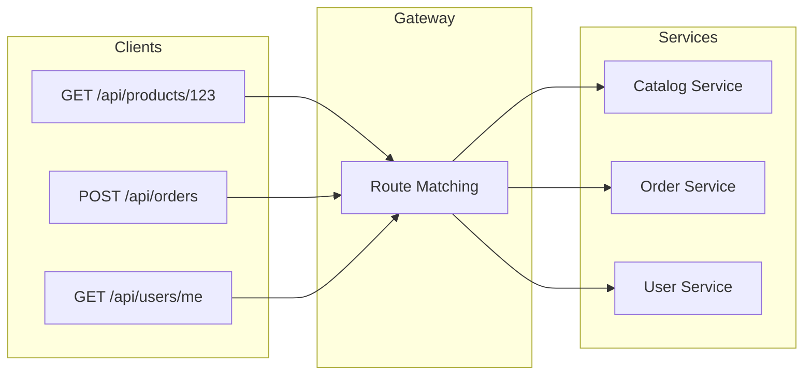
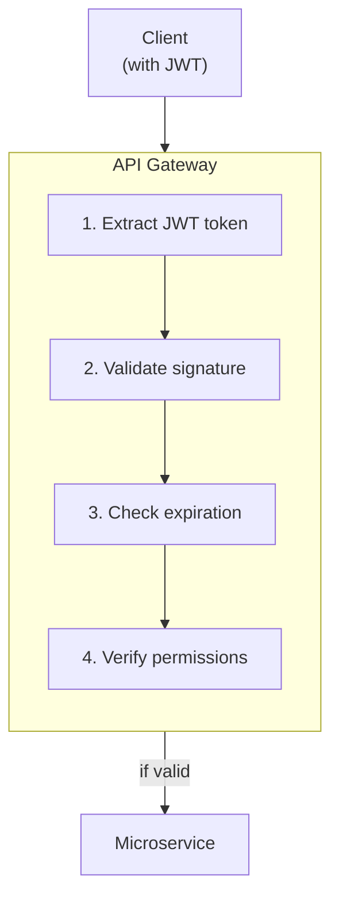
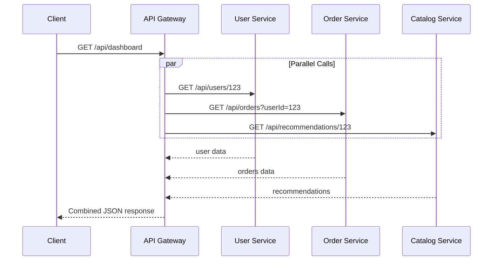
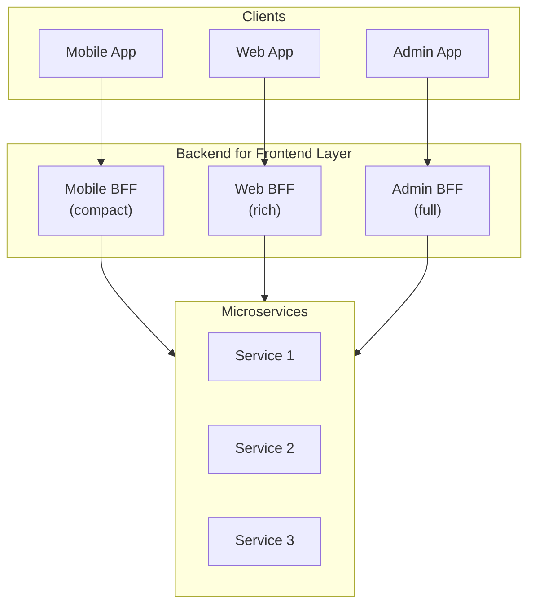
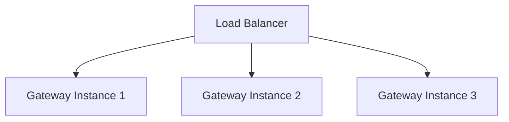

# API Gateway Pattern

An API Gateway acts as a reverse proxy that routes requests from clients to services, handling cross-cutting concerns like authentication, rate limiting, and request aggregation.

---

## Section 1: What is an API Gateway?

<ApiGatewaySimulator mode="intermediate" />

### Request Routing

The gateway routes incoming requests to appropriate backend services:

### Authentication & Authorization

Centralized security handling:

<ProgressCheckpoint section="ag-what-is-gateway" xpReward={15} />

---

## Section 2: Gateway Features

### Rate Limiting

Protect services from being overwhelmed:

| Strategy | Description | Use Case |
| :--- | :--- | :--- |
| Fixed Window | X requests per time window | Simple rate limiting |
| Sliding Window | Smooth rate limiting | Avoid burst at window edges |
| Token Bucket | Allows bursts up to limit | Handling traffic spikes |
| Leaky Bucket | Processes at fixed rate | Consistent throughput |

### Request Aggregation

Combine multiple service calls into one:

### BFF Pattern (Backend for Frontend)

Different clients have different needs:

<ProgressCheckpoint section="ag-gateway-features" xpReward={15} />

---

## Section 3: Implementation Considerations

### Gateway Technologies Comparison

| Gateway | Type | Best For |
| :--- | :--- | :--- |
| **Ocelot** | .NET Library | .NET microservices |
| **YARP** | .NET Library | Modern .NET reverse proxy |
| **Kong** | Standalone | Platform-agnostic |
| **AWS API Gateway** | Cloud Service | Serverless/AWS |
| **Azure API Management** | Cloud Service | Enterprise/Azure |
| **NGINX** | Reverse Proxy | High performance |

### Gateway Anti-Patterns

**Overloaded Gateway** - Don't put business logic in the gateway!

**Single Point of Failure** - Run multiple gateway instances:

### Key Takeaways

- Gateway is the **single entry point** for external clients
- Centralizes **authentication and authorization**
- Handles **rate limiting** to protect services
- **BFF Pattern** provides client-specific gateways
- Don't put **business logic** in the gateway
- Run **multiple instances** for high availability

<ProgressCheckpoint section="ag-implementation" xpReward={15} />
