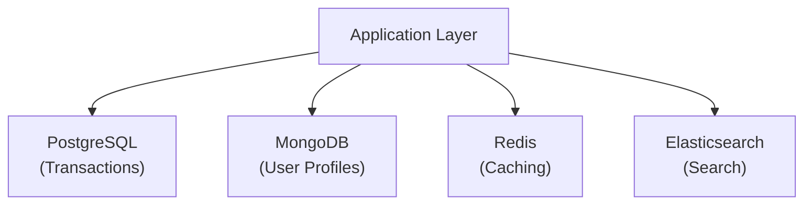
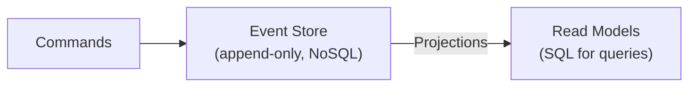

# SQL vs NoSQL: Architecture Deep Dive

Let's examine the fundamental architectural differences and when to use emerging hybrid approaches.

## Theoretical Foundations

### Relational Theory (SQL)

Based on **set theory** and **relational algebra**:

- Relations (tables) are sets of tuples (rows)
- Operations: Selection (σ), Projection (π), Join (⋈)
- Closed under composition (output is another relation)

### NoSQL Theory

Based on distributed systems principles:

- **BASE**: Basically Available, Soft state, Eventually consistent
- **CAP Theorem**: Choose 2 of 3 (Consistency, Availability, Partition tolerance)
- **Eventual Consistency**: All replicas converge given enough time

<RdbmsConceptVisualizer mode="advanced" />

## Storage Engine Comparison

### B-Tree (Most SQL Databases)

```
              [50]                    ← Root
            /      \
       [25,35]     [75,85]            ← Internal
       /  |  \     /  |  \
    [10] [30] [40] [60] [80] [90]     ← Leaf
```

**Characteristics**:

- O(log n) lookups, inserts, deletes
- Optimized for random reads/writes
- Good for OLTP workloads

### LSM-Tree (Many NoSQL)

```
    MemTable (RAM)
         ↓ Flush
    Level 0 SSTables
         ↓ Compaction
    Level 1 SSTables
         ↓ Compaction
    Level N SSTables
```

**Characteristics**:

- Sequential writes (fast)
- Background compaction
- Write-optimized (good for high-ingest)

## Consistency Patterns Deep Dive

### Strong Consistency (SQL Default)

```
Client A writes X=5  →  Primary
                            ↓ sync replicate
Client B reads X     →  Primary  →  Returns 5
                              ↓
                        Replicas must have 5 before ACK
```

### Eventual Consistency (NoSQL)

```
Client A writes X=5  →  Node 1  (returns quickly)
                            ↓ async replicate
Client B reads X     →  Node 2  →  Returns 3 (stale!)
                            ↓
                        Eventually becomes 5
```

### Tunable Consistency (Modern NoSQL)

Cassandra example with consistency levels:

```java
// Strong read (all replicas agree)
SELECT * FROM users WHERE id = 1 USING CONSISTENCY ALL;

// Fast read (any replica)
SELECT * FROM users WHERE id = 1 USING CONSISTENCY ONE;

// Quorum (majority)
SELECT * FROM users WHERE id = 1 USING CONSISTENCY QUORUM;
```

## Hybrid Approaches

### NewSQL Databases

Combining SQL features with NoSQL scalability:

| Database        | Approach                           |
| --------------- | ---------------------------------- |
| **CockroachDB** | SQL over distributed storage       |
| **TiDB**        | MySQL compatible, Raft consensus   |
| **Spanner**     | Google's globally distributed SQL  |
| **YugabyteDB**  | PostgreSQL compatible, distributed |

### Multi-Model Databases

Single database supporting multiple paradigms:

| Database            | Models Supported                           |
| ------------------- | ------------------------------------------ |
| **PostgreSQL**      | Relational + JSON + Full-text + Geospatial |
| **ArangoDB**        | Document + Graph + Key-Value               |
| **Azure Cosmos DB** | Document + Graph + Key-Value + Column      |
| **FaunaDB**         | Relational + Document + Graph + Temporal   |

## Modern Architecture Patterns

### Polyglot Persistence



### Event Sourcing with SQL + NoSQL



## Making the Decision

### Decision Framework

1. **Data Consistency**: Needs ACID? → SQL
2. **Query Complexity**: Complex JOINs? → SQL
3. **Schema Stability**: Evolving rapidly? → Document NoSQL
4. **Scale Requirements**: Global, massive? → Distributed NoSQL/NewSQL
5. **Team Expertise**: SQL skilled? → Leverage it
6. **Operational Maturity**: Need proven reliability? → SQL

### Common Patterns

| Pattern            | Primary | Secondary          | Use Case                |
| ------------------ | ------- | ------------------ | ----------------------- |
| **CQRS**           | SQL     | Redis              | Read/write optimization |
| **Lake House**     | SQL     | Parquet/Delta Lake | Analytics               |
| **Session Store**  | SQL     | Redis              | Fast sessions           |
| **Search Offload** | SQL     | Elasticsearch      | Full-text search        |

<ProgressCheckpoint section="sql-vs-nosql-complete" xpReward={65} />
